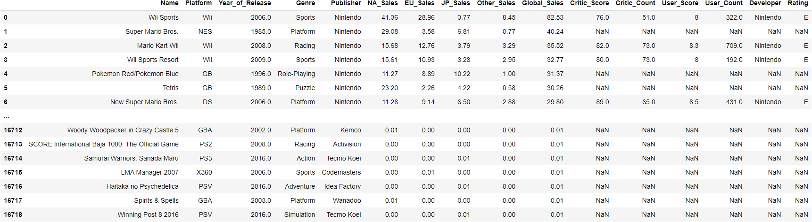

# VideoGameEDA

## About

This is a Mini-Project for SC1015 (Introduction to Data Science and Artificial Intelligence) which focuses on the [Video Game Sales With Ratings](https://www.kaggle.com/datasets/rush4ratio/video-game-sales-with-ratings) Dataset. As passionate gamers, we were curious as to how each video game did in different ears under different region. As such, we have decided to analyse this dataset to see what insights we can gain.

## Dataset Introduction 

The dataset consists of about 17000 entries and 16 unique columns. These columns include variables such as platforms. genres, publishers and many more. Upon seeing the variables, we were interested in how each variable could affect the potential sales in different regions.
With that in mind, as passionate gamers and pontentially furture game developers, the questions that came to our mind were: 
## Objective
- How do we make the most sales out of a game?
- Which variables would be the best at predicting global sales?

For a detailed walkthrough of our project:
## Content
1. [Complete Notebook](videoGameEDA.ipynb)
2. [EDA](EDA.ipynb)
3. [Machine Learning](machineLearning.ipynb)
4. [Python functions for this project](resources/edafunctions.py)

## Models used in this project:
- Linear Regression
- Gradient-Boosting Regression
- K-Nearest Neighbour Regression

## Data Insights

We did not have a desirable result when it comes to predicting sales based on the given variables, so we could not find a definitive answer when it comes to our question of making the most sales from video games. We also found out from the many outliers present that most of the successful games were one hit wonders, which made it harder to predict sales. However, from our data, we learnt that NA sales actually have the highest correlation and prediction accuracy when it comes to global sales, which could be due to the fact that the larger population of gamers worldwide reside in North America. As such, perhaps promoting and catering games towards the NA region could be a possible way of earning higher sales. Furthermore, our EDA showed us that Japan has their own unique “taste” in games, with almost all their findings contrasting that of other regions.

## Conclusion

We realised that the variables in the dataset were not enough to predict Global sales, as there are many other factors that could affect how popular and successful a game can be. Take Wii sports for example, which was an innovative game that implemented real life action into video games to simulate playing the real sport. Wii sport’s success could be attributed to its innovation to not imitate other existing games, but rather create a game that was never seen before. As such, factors like creativity, constant developer updates, beta testing and such could result in a more successful game and consequently higher sales. With that in mind, perhaps there is more to creating a high-selling video game than just the platforms, publishers, genres and such. Instead, its success is also attributed together with the mindset of the developers to ensure the game stays relevant and innovative. 

## Contributors

- [@jianlel](https://github.com/jianlel)
- [@gnijw](https://github.com/gnijw)
- [@dualbricks](https://github.com/dualbricks)

## References

- [SK Learn Regression](https://scikit-learn.org/stable/modules/generated/sklearn.linear_model.LinearRegression.html)
- [Kaggle Dataset](https://www.kaggle.com/datasets/rush4ratio/video-game-sales-with-ratings)

